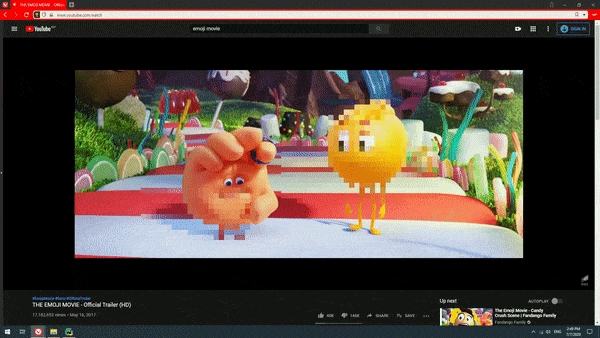
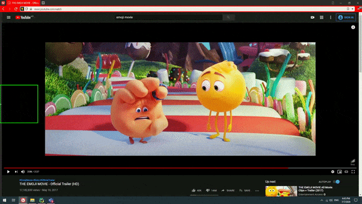
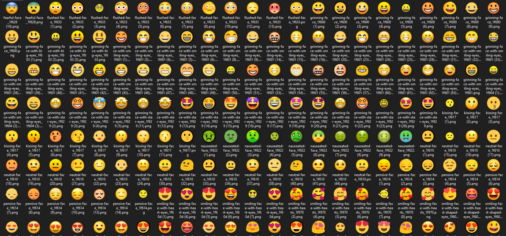

<p align="center">
  <h3 align="center">Emoji Pixelation</h3>
  <p align="center">
    Using sliding window and CNN to identify emoji and pixelate it.
  </p>

  
</p>

## Introduction
A small project that uses Tensorflow and an existing model (ResNet50) to build an emoji pixelater (if this is an actual word). Not using the most efficient computer vision technique, it still does the job pretty well :p



In this project, a box sliding through every 200x200 pixel was used to get that region and passes it to Tensorflow for predicting if that region consist of an emoji. 

Running this system through the whole emoji movie, some emoji's were not detected as our training dataset does not include that specific emoji, for example an emoji wearing glasses. With enough time, patience and perseverance to collect all the emoji dataset, the system would be good to go.

### Dataset


With all ML trainings comes with a miserable time collecting data. Few emojis were downloaded from https://emojipedia.org/people/ using a chrome extension that downloads images on a webpage.

### Future enhancements?!?!
Future enhancement could include proper image segmentation (contour, blob detection etc) to reduce computational steps. Hough circle detection worked pretty well initially, however the poop emoji is not a circle, therefore falling back to the sliding window technique would make more sense for inclusiveness.

## Usage
### Setup
Git clone this repository and run
```
pip install -R requirements.txt
```

### Built With

* Python
* [Tensorflow Transfer Learning](https://www.tensorflow.org/tutorials/images/transfer_learning)
* [OpenCV](https://opencv.org)

### Parameters
In the main.py file, 3 parameters can be customized.
 - WIN_SIZE = 200<br>
   Window size for sliding window. The smaller the window size, the more iterations it goes through.
   
 - STEP_SIZE = WIN_SIZE - 50<br>
   How many pixels the sliding window should move/skip to the next window
 
 - CAPTURE_FRAMES = 120<br>
   How many frames the system will record on your desktop

generate_video.py generates video based on the frames in the output directory

transfer_learning.py will train and create emoji.h5 model based on the ./dataset/ directory

## FAQ
<b>Q:</b> What model is it based on <br>
<b>A:</b> Transfer learning using ResNet50 as the base model.

<b>Q:</b> Why sliding window and not RCNN/FRCNN <br>
<b>A:</b> This project is just built for entertainment, and this method is by far the quickest one I found. It also serves as an introduction to basic computer vision applications. Although, I agree this method would not be the best to accomplish the goal for a production system as it is computational expensive.

<b>Q:</b> Why transfer learning and not building the layers from scratch <br>
<b>A:</b> Due to the small dataset ( < 100 images initially ) and lack of expertise, it would be quicker with higher accuracy using existing weightages which is proven to be reliable.

<b>Q:</b> So why ResNet50 and not other models <br>
<b>A:</b> Tbh there is no consideration here, I just took the first one I saw.

<b>Q:</b> Why emoji's <br>
<b>A:</b> Why not? Although, it is a proof of concept it can be further improved for various use cases such as 
  1. Body parts pixelation in AV
  2. Certain logo/trademark detection in videos etc
  3. Your imagination
